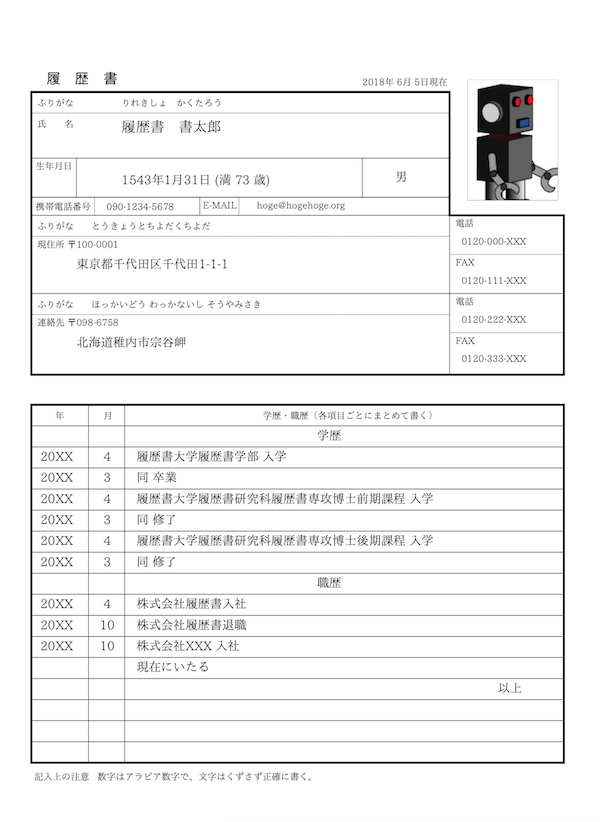
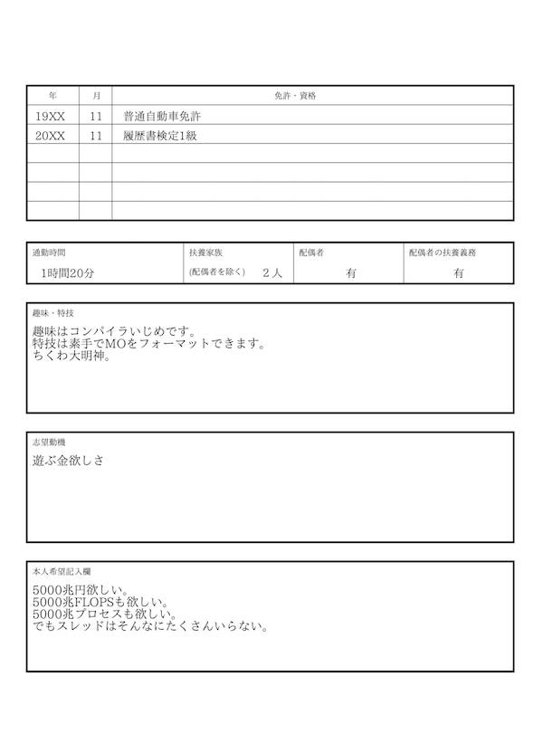
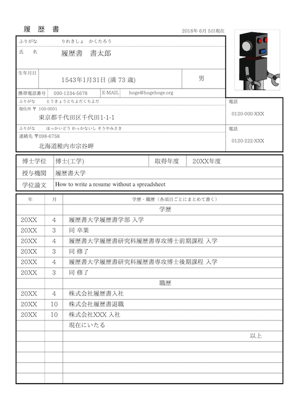
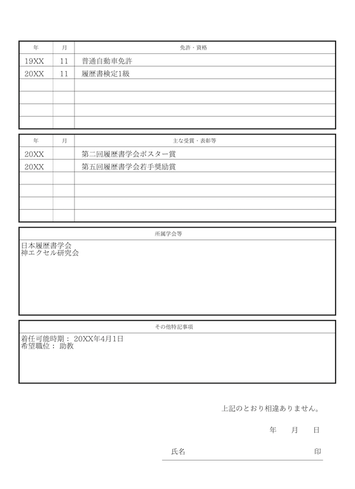
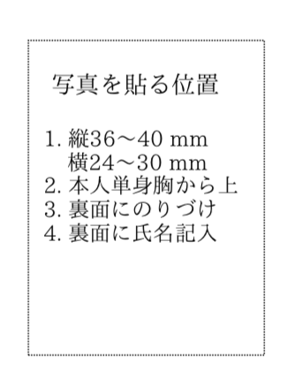
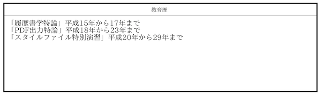

# YAMLによる履歴書作成スクリプト

[](LICENSE)

YAML形式で書かれたデータファイルと、YAMLもしくはテキストファイル形式で書かれたスタイルから履歴書PDFファイルを作成するRubyスクリプトです。

## 履歴書フォーマットについて

このスクリプトで作成される履歴書のフォーマットは、JIS Z 8303『帳票の設計基準』に掲載されていた「履歴書」の様式に則ったものでした。しかし、経済産業省に履歴書の性別欄を無くすよう要望があり、経済産業省からその要望を受け取った一般財団法人日本規格協会は、もともと履歴書の様式は「例」であったとして、JIS Z 8303から履歴書の様式例を削除しました。もともとJIS Z 8303は帳票の寸法を定めるもので、個々の様式(フォーマット)を定めるものではなかったのですが、あくまで例として掲載されていた「履歴書」の様式が、「JIS規格のフォーマットである」と誤解されて広まったものだったようです。すなわち、JIS規格の履歴書というものはもともと存在せず、JISに記載されていた履歴書フォーマットも削除された今、このスクリプトの作るフォーマットに公的な意味はありません。ご利用の際は上記についてご承知おきください。

## 使い方

### 簡単な使用方法

[ikasam](https://github.com/ikasam)さんが、[Dockerを使う実行環境](https://github.com/ikasam/docker-yaml_cv)を作ってくださっています。Docker環境がある方はいろいろインストールしなくても`git clone`して`docker-compose up`するだけでPDFが作成されるので便利です。

また[jerrywdlee](https://github.com/jerrywdlee)さんが、[YAML to 履歴書](https://yaml-2-resume.herokuapp.com/)というウェブサービスを公開されています。そちらだとブラウザだけあれば履歴書PDFが作成できて便利です。

### 必要なライブラリ等

このリポジトリを利用して、ローカルで運用するためには、Rubyの実行環境と以下のライブラリ、フォントが必要になります。

* Prawn
* IAPexフォント

Prawnから日本語を出力するためにIPAexフォントを使っています。スクリプトと同じ場所にfontsディレクトリを用意して、[ここ](https://moji.or.jp/ipafont/ipaex00401/)からフォントをダウンロードして以下のように配置してください。

```txt
├── fonts
│   ├── ipaexg.ttf
│   └── ipaexm.ttf
└── make_cv.rb
```

### 実行方法

以下のように、`-i`に続けてデータファイル、`-s`に続けてスタイルファイル、`-o`に続けて出力ファイルを指定します。省略した場合のデフォルトはそれぞれ`data.yaml`、`style.txt`、`output.pdf`です。

```sh
$ ruby make_cv -h
Usage: make_cv [options]
    -i, --input [datafile]
    -s, --style [stylefile]
    -o, --output [output]
```

YAML形式のデータファイル(例:`data.yaml`)とスタイルファイル(例:`style.txt`)を用意し、スクリプトを以下のように実行します。

```sh
ruby make_cv.rb -i data.yaml -s style.txt -o output.pdf
```

添付のサンプルでは以下のような出力が得られます。

[PDFファイル](sample/output.pdf)




また、スタイルファイルを変えることで、同じデータファイルから異なる出力を得られます。以下はアカデミックポスト向けのスタイルファイル`academic.txt`を使った場合です。

```sh
ruby make_cv.rb -i data.yaml -s academic.txt -o academic.pdf
```

[PDFファイル](sample/academic.pdf)




### データの用意の仕方

データはYAML形式で用意します。

以下はサンプルの`data.yaml`の一部です。

```YAML
# 名前等
date: 2018年 6月 5日現在
name_kana: りれきしょ　かくたろう
name: 履歴書　書太郎
birth_day: 1543年1月31日 (満 73 歳)
gender: 男
cell_phone: 090-1234-5678
email: hoge@hogehoge.org
photo: photo.jpg

# 住所
address_kana: とうきょうとちよだくちよだ
address: 東京都千代田区千代田1-1-1
address_zip: 100-0001
tel: 0120-000-XXX
fax: 0120-111-XXX
# 連絡先
address_kana2: ほっかいどう わっかないし そうやみさき
address2: 北海道稚内市宗谷岬
address_zip2: 098-6758
tel2: 0120-222-XXX
fax2: 0120-333-XXX
```

例えば、写真が`photo.jpg`として用意してある場合、

```YAML
photo: photo.jpg
```

とすれば写真が貼られます。もし写真ファイルを指定しなかった場合、例えば

```YAML
# photo: photo.jpg
```

としてコメントアウトすると、写真部分は



のような出力になります。

## スタイルファイル

履歴書のスタイルファイルは、一行に一要素ずつ記述していきます。例えば`academic.txt`は以下のような内容になっています。

```txt
# ヘッダー
string,5mm,247mm,履　歴　書,font_size=14,font_face=gothic
string,110mm,245mm,$date,font_size=9

# 住所・連絡先等
box,145mm,204mm,30mm,40mm,line_style=dashed
string,148mm,240mm,写真を貼る位置,font_size=9
string,147mm,233mm,1. 縦36〜40 mm,font_size=8
string,150mm,230mm,横24〜30 mm,font_size=8
string,147mm,227mm,2. 本人単身胸から上,font_size=8
string,147mm,224mm,3. 裏面にのりづけ,font_size=8
string,147mm,221mm,4. 裏面に氏名記入,font_size=8
```

一行目の

```txt
string,5mm,247mm,履　歴　書,font_size=14,font_face=gothic
```

は、(5mm,247mm)の位置に「履　歴　書」という文字を、フォントサイズ14で、フォントはゴシックで記述する命令です。このうち必須なのは座標と文字列ですが、その後にオプションとしてフォントサイズやフォントの指定ができます。

次の行の

```txt
string,110mm,245mm,$date,font_size=9
```

も同様に(110mm, 245mm)の位置に文字列を出力する命令ですが、出力する文字列が`$date`となっています。これは、データファイルの`data`要素に置換されます。今、データファイルは

```yaml
date: 2018年 6月 5日現在
```

とあるので、

```txt
string,110mm,245mm,$date,font_size=9
```

は

```txt
string,110mm,245mm,2018年 6月 5日現在,font_size=9
```

に展開されます。

テキスト形式の命令リストは以下の通りです。

命令| フォーマット| 説明
-- | ----       | ----
string | string, x, y, value[,font options] | (x,y)に文字列valueを出力
line | line, x, y, dx, dy[,line options] | (x,y)から(x+dx, y+dy)に線を描画
box | box,x,y,width,height[,line options]| (x,y)に指定された幅と高さのボックスを描画
photo  |photo, x, y, width, height   |  指定位置、サイズに写真ファイル`$photo`を描画
new_page  |new_page   |  改ページ
textbox  |textbox,x,y,width,height,value[,font options] |指定位置、サイズにテキストボックスを描画  
multi_lines| multi_lines, x,y,dx,dy,num,sx,sy| (x,y)から、(dx,dy)方向に、毎回(sx,sy)だけ座標をずらしながらnum回線を引きます
ymbox| ymbox,title,height,num,$value | $valueをhistoryデータとして、高さyに、年月表を作るマクロです。
miscbox| miscbox,title,y,height,$value | タイトル付きテキストボックスです。$valueの内容をテキストボックス内に展開します。

### 特別な命令

#### history

年、月、内容をともなったデータを描画する命令です。ymboxやmiscboxの内部で呼ばれます。

```txt
history, y, year_x, month_x, value_x, dy, value[,font options]
```

* y: 描画を始めるy座標
* year_x, month_x, value_x: それぞれ年、月、内容を書くx座標
* dy: 改行時にどれだけ下に下げるか
* value: 内容

history環境に使われるデータは以下のように指定します。

```yaml
licences:
  -
    year: 19XX
    month: 11
    value: 普通自動車免許
  -
    year: 20XX
    month: 11
    value: 履歴書検定1級
```

`year`や`month`は省略可能です(空白になります)。

#### education_experience

学歴、職歴を書く命令です。命令フォーマットは以下の通りです。

```txt
education_experience, y, year_x, month_x, value_x, dy, caption_x, ijo_x, [,font options]
```

* y: 描画を始めるy座標
* year_x, month_x, value_x: それぞれ年、月、内容を書くx座標
* dy: 改行時にどれだけ下に下げるか
* caption_x: 「学歴」や「職歴」の文字のx座標
* ijo_x: 「以上」の文字のx座標

なお、学歴データは`$education`が、職歴データは`$experience$`が仮定されます。

#### lines

複数の線を書く命令です。履歴書によくある右上が凹んだボックスを書くために用意してあります。命令フォーマットは以下の通りです。

```txt
lines, num, x,y, dx, dy, ..., [,line options]
```

最初に「何個の点データがあるか」を`num`で指定します。その後、始点、次の点の相対座標・・・と続け、最後に線のオプションを指定します。なお、この命令だけのオプションとして「close」というものがあります。これを指定すると最後に線を閉じます。

#### ymbox

「年、月、事柄」を書くマクロです。例えば

```txt
ymbox,免許・資格,204mm,4,$licences
```

は、「免許・資格」というタイトルの4行分の年月ボックスを、高さ204mmのところに配置する、という意味です。最後がデータのYAMLファイルの対応するレコードです。例えば、

```yaml
# 免許・資格
licences:
  - 
    year: 19XX
    month: 11
    value: 普通自動車免許
  - 
    year: 20XX
    month: 11
    value: 履歴書検定1級
```

というデータだったとすると、


に展開されます。

```txt
ymbox,免許・資格,204mm,4,$licences,font_size=9
```

などのように、最後にフォントサイズを指定できます。

#### miscbox

タイトル付きのテキストボックスに展開されるマクロです。例えば、

```txt
miscbox,教育歴,120mm,50mm,$teaching,font_size=12
```

は、「教育歴」というタイトルの高さ(height)50mmのテキストボックスを、高さ(y座標)120mmのところに配置する、という意味です。最後のフォントサイズ指定は任意です。対応するYAMLレコードは\$teachingです。

例えば

```yaml
# 教育歴
teaching: |
  「履歴書学特論」平成15年から17年まで
  「PDF出力特論」平成18年から23年まで
  「スタイルファイル特別演習」平成20年から29年まで
```

というデータだったとすると、



に展開されます。

### スタイルファイル(YAML形式)

上記のテキスト形式で書かれたスタイルファイルは内部的にYAMLに変換されて処理されているため、スタイルファイルはYAML形式でも書くことができます。・・・が、実際やってみたら死ぬほど面倒だったので、通常はテキスト形式で書くことになろうかと思います。テキスト形式のスタイルファイルは`txt2yaml.rb`でYAML形式に変換できます。

例えば

```txt
string,5mm,247mm,履　歴　書,font_size=14,font_face=gothic
string,110mm,245mm,$date,font_size=9
```

を`txt2yaml.rb`に食わせると、

```yaml
---
- type: string
  x: 5mm
  y: 247mm
  value: 履　歴　書
  font_size: '14'
  font_face: gothic
- type: string
  x: 110mm
  y: 245mm
  value: "$date"
  font_size: '9'
```

が出力されます。同様にYAMLで書かれたスタイルファイルは`yaml2txt.rb`でテキスト形式に変換できます。

## 参考

このスクリプトは、[PruneMazui](https://github.com/PruneMazui)さんの[resume-maker](https://github.com/PruneMazui/resume-maker)に影響されて開発したものです。

## 履歴

* 2018年7月30日 ymboxマクロ及びmiscboxマクロを追加
* 2018年6月6日 リリース

## ライセンス

MIT
